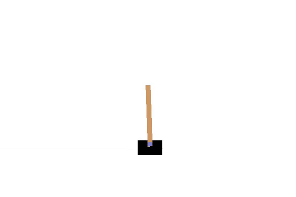

# REINFORCE

### Instructions

Open the notebook `Reinforce_Colab.ipynb` to see an application of the REINFORCE algorithm (also known as Monte Carlo Policy Gradients) to the OpenAI Gym's Cartpole environment. This notebook runs on the Google `Colab` environment where access to GPUs is freely available. Alternatively, you can download the `Reinforce.ipynb` notebook and run locally.

Experiment with changing the training parameters in the notebook to understand how the learning of the agent is affected.

### Results 

In the Cartpole environment a pole (pendulum) is attached by an un-actuated joint to a cart, which moves along a frictionless track. The pole (pendulum) is placed upright on the cart and the goal is to balance it by applying forces in the left and right direction on the cart.

Below is a gif showing the reinforce trained agent balancing the pole.

